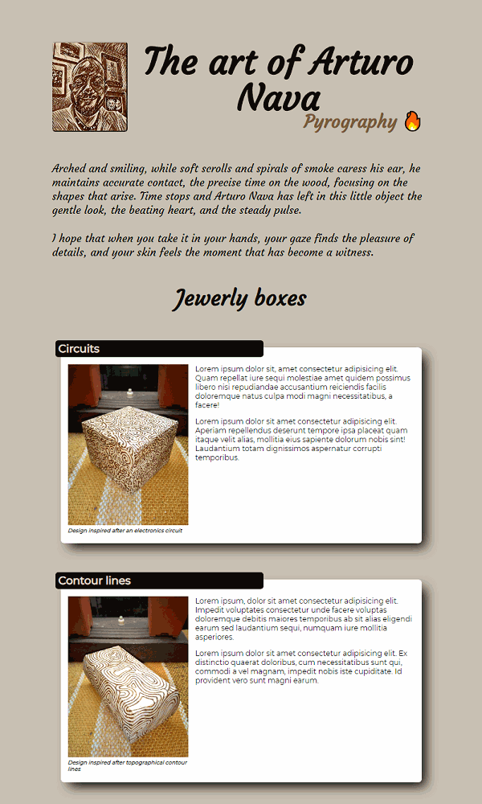

# Pyrography catalog

This project aims to be a prototype of a virtual showroom for the art of the Mexican pyrographer ***Arturo Nava***.

The design is fully responsive and looks good on wide screens as on small ones. It's mainly a proof-of-concept.

## Built with:
- HTML
- SASS / CSS
- ☕ More coffee

## Live demo
- [The art of Arturo Nava](https://oscarnava.me/pirograbarte/)

## 👤 Author
  ### *Oscar Nava Trujillo*
  - email: [contact@oscarnava.me](mailto:contact@oscarnava.me)
  - Github: [@oscarnava]( https://github.com/oscarnava )
  - Linkedin: [Oscar Nava Trujillo](https://www.linkedin.com/in/oscar-nava-trujillo/)

## ⌛ To-do's
  - [ ] Enable a bigger view when the image is clicked
  - [ ] Carrousell display when clicking on the header title

## 📦 Contributing
Contributions, issues and feature requests are welcome!

Feel free to check the [issues page](https://github.com/oscarnava/Pyrography-catalog/issues).

## 💬 Credits
- Design inspired by [this dribbble](https://dribbble.com/shots/9776858-Kupula-Google-Slide-Template)
- Images are property of [Arturo Nava Trujillo](mailto:arturonavat@gmail.com)

## 🗝 License
Creative Commons [Attribution 4.0 International (CC BY 4.0)](https://creativecommons.org/licenses/by/4.0/).

## 📡 Contact

Please don't hesitate to contact me at 📧 [contact@oscarnava.me](mailto:contact@oscarnava.me) if you have any questions, comments, etc. I would love to know what's on your mind!
